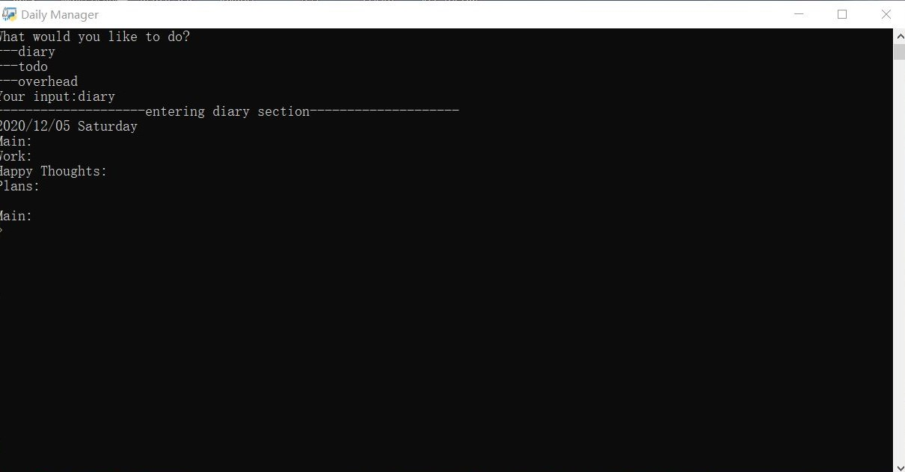

## Daily Manager
Making a todo list, a finance sheet on separate word and excel document and perhaps forget about it?
Or it takes so much time to find the location of the file when ever it is needed?

Having such problems myself, I tried coming with a command-line based python application that will hopefully integrate daily life problem into a single program.

The solutions come in modules. Each module can be run on its own, or from the entrypoint.

Current Modules:
* diary
* todo
* overhead
* focus (currently under development and prone to error)



#### Prerequisites
* Python 3
* [python-docx](https://python-docx.readthedocs.io/en/latest/user/install.html) (for diary module)
* [openpyxl](https://openpyxl.readthedocs.io/en/stable/) (for overhead module)

#### Usage
Either download code ZIP file or use the following command:
```buildoutcfg
git clone https://github.com/LostwandererJerry/Daily-Manager.git
```

Before use, change file name of config-demo.py (in Daily-Manager/src) to config.py

Run entrypoint.py to start.

#### File structure
```bash
├─Daily-Manager
│  │  entrypoint.py
│  │
│  ├─presentables
│  │      placeholder.txt
│  │
│  └─src
│      │  config-demo.py
│      │  publicstuff.py
│      │
│      ├─Diary
│      │      betterDiaryWritter.py
│      │      diaryWritter.py
│      │
│      ├─Finance
│      │      overhead.py
│      │
│      └─myPlans
│              TODOs.py
```
All the file path are specified in config file, change file path to link to your own diary.
By default, they will be generated in the presentable folders.